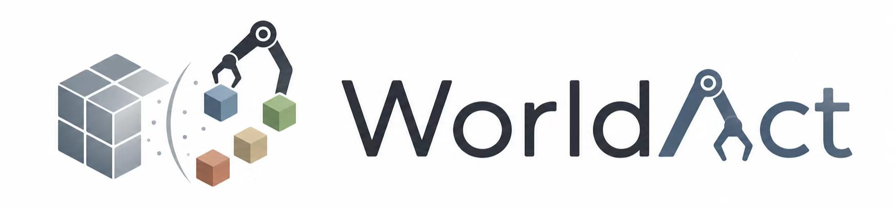
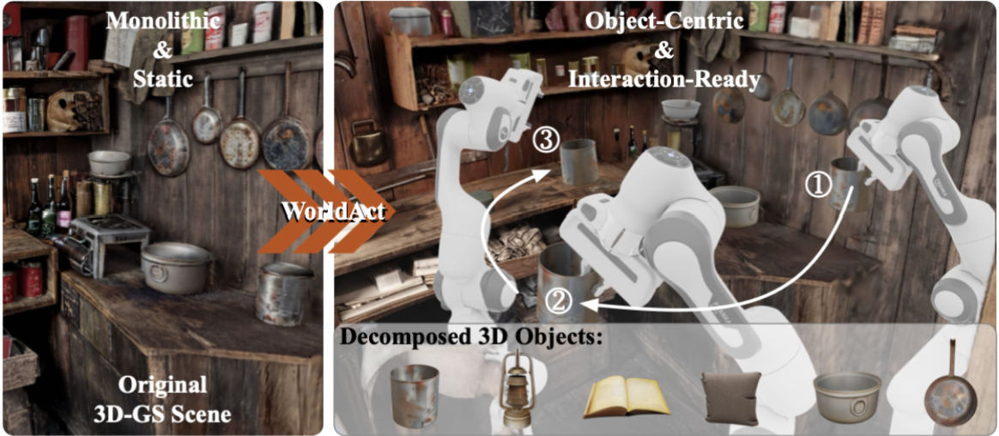
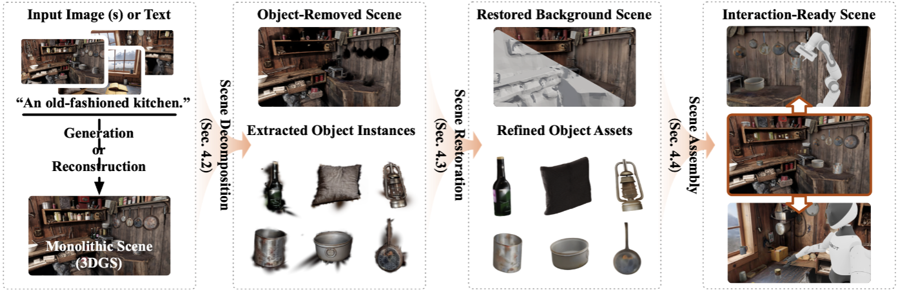
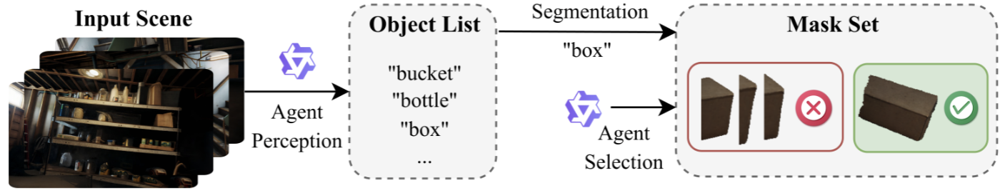
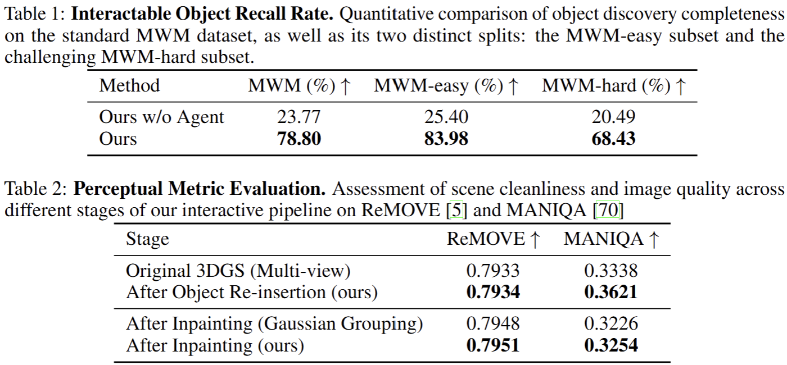
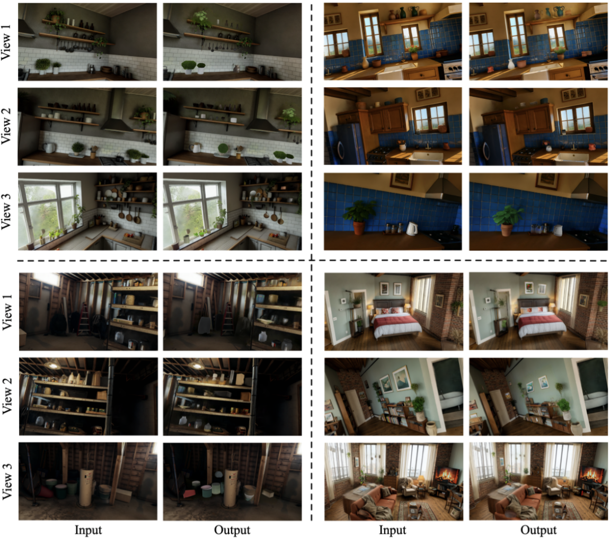
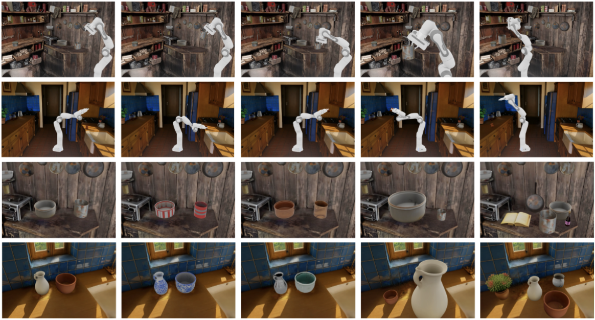

# WorldAct: Activating Monolithic 3D Worlds into Interactive-Ready Object-Centric Scenes

<p align="center">
  
</p>

[Jichen Hu](https://github.com/Abuuu122), [Jiawei Guo](https://github.com/GuoCalix), [Jiazhong Cen](https://github.com/Jumpat), [Chen Yang](), [Sikuang Li](), [Wei Shen]()

"WorldAct: Activating Monolithic 3D Worlds into Interactive-Ready Object-Centric Scenes"
<p align="center">
  <a href=https://sjtu-deepvisionlab.github.io/WorldAct></a>
  <a href="https://github.com/SJTU-DeepVisionLab/WorldAct/releases"></a>
  <a href="https://github.com/SJTU-DeepVisionLab/WorldAct"></a>
  <a href="#"></a>
  <a href="#"></a>
  <a href="https://github.com/SJTU-DeepVisionLab/WorldAct/stargazers"></a>
</p>


#### 🔥🔥🔥News

- **2026-05-14:** This repository is released.

---

> Recent 3D world modeling systems based on generative scene synthesis, such as Marble, can create coherent and explorable 3D environments, yet their outputs are typically static monolithic assets with limited editability and physical interaction. This restricts their use in immersive content creation and embodied simulation, where generated worlds must be actively modified and manipulated. To tackle this challenge, we present WorldAct, a framework that converts static generated 3D worlds into editable and interaction-ready scenes. WorldAct uses a multimodal agent to guide scene decomposition, identify actionable objects, reconstruct geometrically aligned object-level meshes for interaction, and restore the residual background via 3D inpainting. The resulting scenes support object-level editing, collision-aware manipulation, and embodied task execution while preserving global scene coherence. Experiments show that WorldAct enables richer interaction scenarios than the original generated scenes, suggesting a practical path toward editable and interactive 3D world models.



---

### Pipeline





---

## TODO

- [ ] Release training code.
- [ ] Publish datasets.

## Contents

1. [Testing](#testing)
2. [Results](#results)
3. [Citation](#citation)
4. [Acknowledgements](#acknowledgements)

## <a name="testing"></a>Testing

TBD

## <a name="results"></a>Results

We present the performance of our proposed WorldAct framework.

<details open>
<summary>Quantitative Results (click to expand)</summary>

- Results in Tab. 1 and Tab. 2 of the main paper

  

</details>

<details open>
<summary>Qualitative Results (click to expand)</summary>

- Results in Fig. 4 of the main paper

  

- Results in Fig. 5 of the main paper

  

</details>

## <a name="citation"></a>Citation

If you find our model or code helpful in your research or work, please cite the following paper.

```bibtex
@article{hu2026worldact,
      title={WorldAct: Activating Monolithic 3D Worlds into Interactive-Ready Object-Centric Scenes},
      author={Jichen Hu and Jiawei Guo and Jiazhong Cen and Chen Yang and Sikuang Li and Wei Shen},
      year={2026}
}
```

## <a name="acknowledgements"></a>Acknowledgements

This project builds on numerous model repositories. We thank [Marble](https://marble.worldlabs.ai/) and [SAM3D](https://ai.meta.com/research/sam3d/) for the research ideas that inspired this work.
